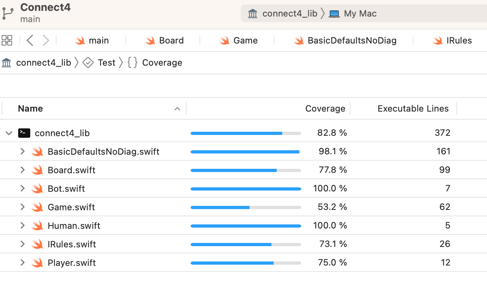

[](https://codefirst.iut.uca.fr/alexis.drai/connect4-swift)

# Connect 4

## Code coverage and quality

Code quality can be found [hosted on SonarCloud](https://sonarcloud.io/project/overview?id=draialexis_connect4-swift)

Coverage was maintained above 80%. Some private methods were neglected, but would end up being covered if we implemented this app more completely.



## Class diagram


## Choices

This app consists of a `Game` class that implements various elements necessary for a game of Connect4. The core of the game is implemented in an `IRules` protocol, defining the behavior of the game. The protocol specifies a set of variables such as the minimum and maximum number of rows and columns, and the number of chips to align in order to win the game. It also includes methods for determining if the game is over, if a board is valid, and for finding the next player. 

The IRules protocol is implemented by the `BasicDefaultsNoDiag` struct, which provides a basic set of rules for playing Connect4 without diagonal wins. We added defaults in the intializer to specify a minimum of 3 rows and columns, and a maximum of 15 rows and columns, and 4 chips to be aligned in order to win. Moreover, a few unimaginable boards are completely prevented from being legal in this app: the board needs to be large enough, the number of chips to align needs to be within a reasonable interval... 

```swift
guard (minNbRows >= 3
        && minNbCols >= 3
        && maxNbRows >= minNbRows
        && maxNbCols >= minNbCols
        && nbChipsToAlign >= 2
        && nbChipsToAlign <= minNbCols
        && nbChipsToAlign <= minNbRows) 
else { return nil }
```

The `Game` class has two `Player` objects, a `Board` struct, and an implementation of the `IRules` protocol. `Game` uses the methods and variables defined in the IRules protocol to manage the state and behavior of the game.

### Basic Rules

To keep things simple, the basic rules we implemented don't allow for diagonal victories. But because we used an `IRules` protocol to initialize the `Game` class, we could implement a more complete set of rules later on. 

### `Player.play(Board, IRules)`

We can use the game's board as a parameter in the `play()` function, and we never have to worry about the `Player` class destroying the board, because it is a struct, and therefore passed by copy to `play()`. If someone extends the `Bot` class and makes a `SmarterBot`, they could even use said board to make test-plays and decide which play to go for.

### Board 

`Board` is implemented as a 2D grid of optional integers. The size of the board can be specified by the number of rows and columns, but it must have at least 3 rows and 3 columns with our current implementation of `IRules`. `Board` implements custom string conversion so it can be easily printed to the console. It can insert chips, check if the board is full, and display a victory message.

### Game
The `scanner` property is used to get the input from human players, and the `play()` method is used to make one play. Itstarts by determining which player is next, based on the grid state and player ids, and then calls the `chooseColumn()` method on the player to get the selected column. The `insertChip()` method is called on the board with a selected column. If the chip insertion is successful, the method returns `true`, otherwise it returns `false`. There is an `isOver` property to indicate whether the game is over.

## How to play

Here is `connect4_cli/main.swift`:

```swift 
var status: (isOver: Bool, result: Result)

if let rules = BasicDefaultsNoDiag(),
   let board = Board(),
   let p1 = Human(withId: 1,
                  withName: "Geraldine Humanman",
                  usingScanner: scan),
   let p2 = Bot(withId: 2,
                withName: "Botty McBotFace"),
   let game = Game(withScanner : scan,
                   withBoard: board,
                   withRules: rules,
                   withPlayer1: p1,
                   withPlayer2: p2) {
    print(game.boardString)
    while(!(game.isOver)) {
        if game.play() {
            print(game.boardString)
            
        }
    }
    print(game.gameOverString)
}
```

The objects that need to be injected into `Game` are created first, then injected, before the game loop starts with `while(!(game.isOver))`. As it is currently, if you simply launched the `connect4_cli` app, you would start playing against a bot, using the original rules from Connect4 (except: without diagonal victories). You could of course instantiate the objects differently, instead of using the default values of their initializers. Indeed, you could also make `p1` and `p2` both `Humans`, of both `Bots`, as long as you inject two `Players` into `Game`. 

## Bot vs bot

This is what a bot vs bot game looks like. The number on the bot's face is their `id`.


